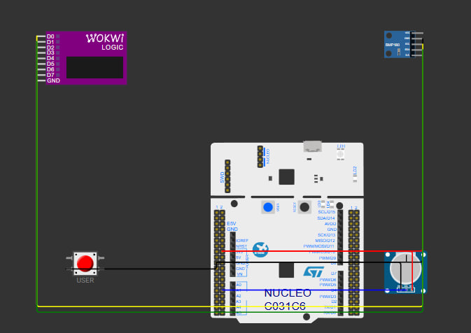
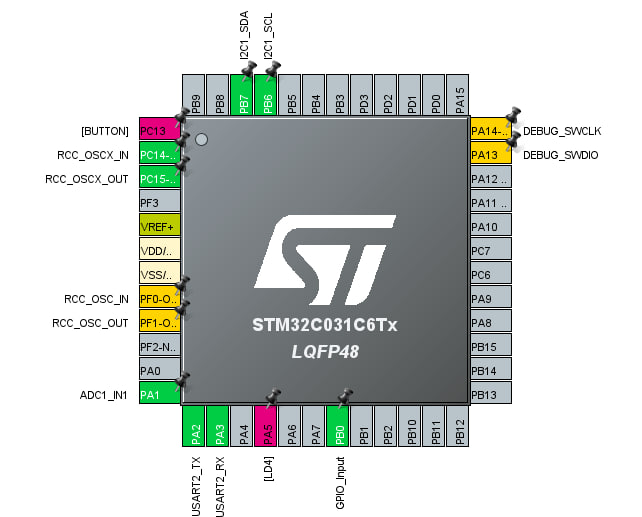
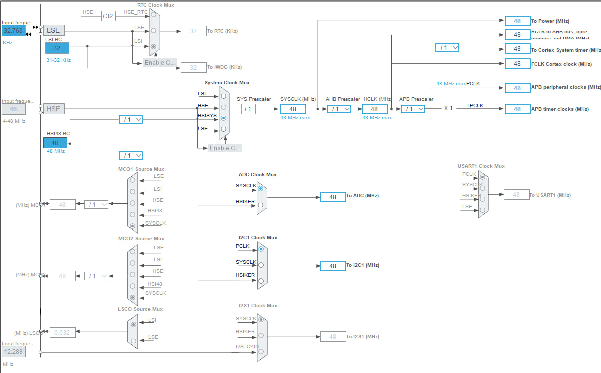
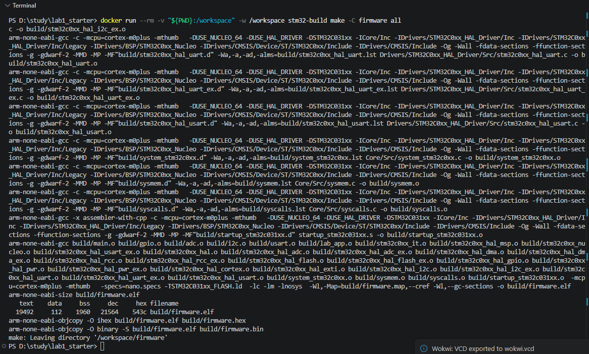
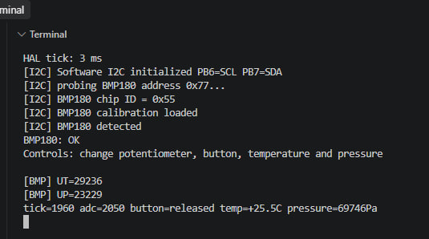
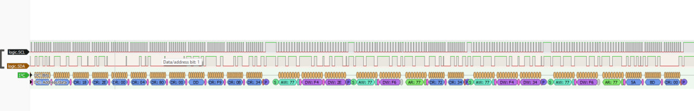
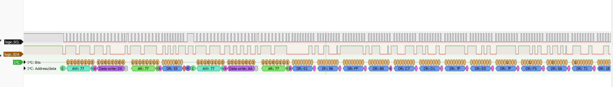

# Лабораторна робота №1

## Налаштування середовища розробки та bring-up STM32-платформи

**Дисципліна:** Системне програмування вбудованих систем  
**Форма виконання:** B - Wokwi  
**Виконав:** [Шевчук Арсеній Сергійович]  
**Група:** [ІО-35]  

## 1. Мета роботи

Мета роботи - налаштувати нормальне середовище для розробки під STM32 і перевірити, що проєкт можна стабільно зібрати, запустити у Wokwi та протестувати основні інтерфейси мікроконтролера.

Під час роботи я налаштував збірку через Docker, створив проєкт у STM32CubeMX, перевірив UART, ADC, GPIO та I2C, підключив BMP180, потенціометр і кнопку, а також перевірив I2C-обмін через Logic Analyzer і PulseView.

## 2. Використане середовище

У роботі використовувалися:

- Windows;
- VS Code;
- Docker Desktop;
- WSL;
- STM32CubeMX;
- STM32 HAL;
- `gcc-arm-none-eabi`;
- Wokwi for VS Code;
- PulseView;
- NUCLEO-C031C6.

Програма написана мовою C з використанням STM32 HAL.

## 3. Схема

У фінальній схемі використані такі компоненти:

| Компонент | Інтерфейс | Підключення |
|---|---|---|
| BMP180 | I2C | PB6=SCL, PB7=SDA |
| Potentiometer | ADC | PA1=ADC1_IN1 |
| Pushbutton | GPIO | PB0 |
| Serial Monitor | UART | PA2=TX, PA3=RX |
| Logic Analyzer | I2C | D0=PB6, D1=PB7 |

На схемі видно NUCLEO-C031C6, BMP180, потенціометр, кнопку та Logic Analyzer.



## 4. Налаштування STM32CubeMX

### 4.1 Pinout

У CubeMX були налаштовані такі піни:

- PA1 -> ADC1_IN1;
- PA2 -> USART2_TX;
- PA3 -> USART2_RX;
- PB0 -> GPIO Input;
- PB6 -> I2C1_SCL;
- PB7 -> I2C1_SDA.

Також на схемі CubeMX видно вбудовану кнопку B1 на PC13, але у програмі для тесту використовується окрема кнопка на PB0.



### 4.2 Clock Configuration

Системна частота налаштована на 48 MHz:

- SYSCLK = 48 MHz;
- HCLK = 48 MHz;
- PCLK = 48 MHz;
- I2C1 clock = 48 MHz;
- ADC clock = 48 MHz.

Для SYSCLK використовується внутрішній HSI48.



## 5. Збірка через Docker

Для збірки використовується Docker. Це дозволяє не залежати від того, які саме інструменти встановлені у Windows.

Команда збірки:

```powershell
docker run --rm -v "${PWD}:/workspace" -w /workspace stm32-build make -C firmware all
```

На скріншоті видно успішний compile, link і створення:

- `firmware.elf`;
- `firmware.hex`;
- `firmware.bin`.

Також видно розмір прошивки через `arm-none-eabi-size`.



**Commit:** [ДОДАТИ URL]

## 6. UART

USART2 працює на швидкості 115200 бод.

Для роботи `printf()` була додана функція `_write()`, яка передає дані через `HAL_UART_Transmit()`.

Після запуску симуляції отримуємо:

```text
HAL tick: 3 ms
[I2C] Software I2C initialized PB6=SCL PB7=SDA
[I2C] probing BMP180 address 0x77...
[I2C] BMP180 chip ID = 0x55
[I2C] BMP180 calibration loaded
[I2C] BMP180 detected
BMP180: OK
Controls: change potentiometer, button, temperature and pressure

[BMP] UT=29236
[BMP] UP=23229
tick=1960 adc=2050 button=released temp=+25.5C pressure=69746Pa
```

Цей лог одночасно показує, що працюють UART, BMP180, ADC і GPIO.



**Commit:** [ДОДАТИ URL]

## 7. ADC

Потенціометр підключений до `PA1 / ADC1_IN1`.

ADC працює у 12-bit режимі. Під час обертання потенціометра значення `adc` у UART змінюється. Це підтверджує, що аналоговий вхід працює правильно.

У тестах значення доходило приблизно від 0 до 4095.

## 8. GPIO

Кнопка підключена до PB0 і GND.

Для PB0 використовується Pull-Up, тому логіка така:

- кнопка не натиснута -> `button=released`;
- кнопка натиснута -> `button=PRESSED`.

Під час тесту стан кнопки змінювався у UART без перезапуску симуляції.

## 9. BMP180 та I2C

BMP180 має I2C-адресу `0x77`.

Під час запуску програма читає CHIP_ID з регістра `0xD0`. Отримане значення - `0x55`.

Після цього читаються calibration coefficients з регістрів `0xAA-0xBF`.

Для температури використовується команда:

```text
0xF4 <- 0x2E
```

Для тиску у режимі OSS=0:

```text
0xF4 <- 0x34
```

Після цього читаються raw temperature і raw pressure з регістрів починаючи з `0xF6`.

Приклад отриманих даних:

```text
[BMP] UT=29236
[BMP] UP=23229
tick=1960 adc=2050 button=released temp=+25.5C pressure=69746Pa
```

Під час зміни temperature і pressure у Wokwi значення у UART теж змінювалися. Наприклад, під час тестування були отримані:

```text
temp=+24.0C pressure=101327Pa
temp=+67.4C pressure=101325Pa
temp=+67.4C pressure=55248Pa
temp=+25.5C pressure=69746Pa
```

Це показує, що значення реально читаються з моделі BMP180.

## 10. Logic Analyzer

Logic Analyzer підключений:

- D0 -> PB6 / SCL;
- D1 -> PB7 / SDA.

Після зупинки Wokwi був створений VCD-файл. Його я відкрив у PulseView і додав I2C decoder.

На декодованому сигналі видно адресу BMP180 `0x77`, команди, register addresses, ACK і data bytes.

На одному з фрагментів видно читання CHIP_ID:

```text
Address write: 77
Data write: D0
Address read: 77
Data read: 55
```

Це означає, що програма:

1. звернулась до BMP180 за адресою `0x77`;
2. вибрала регістр `0xD0`;
3. зробила повторний START;
4. виконала read;
5. отримала `0x55`.

Також на ширшому capture видно подальший I2C-обмін, у тому числі роботу з регістрами `0xF4`, `0xF6` та іншими байтами, які використовуються під час вимірювання.





**Commit:** []

## 11. Порядок виконання роботи

1. Підготував starter repository.
2. Налаштував WSL і Docker.
3. Перевірив ARM build у Docker.
4. Створив проєкт у STM32CubeMX для NUCLEO-C031C6.
5. Налаштував UART і `printf()`.
6. Налаштував ADC та GPIO.
7. Почав bring-up I2C-сенсора.
8. Пробував MPU6050, але повний цикл write/read працював нестабільно.
9. Пробував перенести проєкт на STM32F103 Blue Pill, але HAL clock/UART у Wokwi працювали нестабільно.
10. Повернувся на NUCLEO-C031C6 і вибрав BMP180.
11. Отримав правильний CHIP_ID `0x55` та calibration coefficients.
12. Знайшов проблему hardware I2C при записі measurement command.
13. Реалізував software I2C через HAL GPIO.
14. Виправив open-drain логіку у software I2C.
15. Отримав стабільне читання temperature і pressure.
16. Записав I2C через Wokwi Logic Analyzer.
17. Перевірив транзакції у PulseView через I2C decoder.

## 12. Основні проблеми та їх вирішення

У звіті я залишив тільки ті проблеми, які реально вплинули на хід роботи і вимагали окремої діагностики.

### Проблема 1 - Docker не запускався через відсутній WSL

**Симптом:** Docker Desktop був встановлений, але Linux backend не запускався нормально.

**Причина:** hardware virtualization у Windows була увімкнена, але сам WSL не був встановлений.

**Як знайшов:** перевірив virtualization у Task Manager і окремо перевірив наявність WSL.

**Рішення:** виконав:

```powershell
wsl --install
```

Після встановлення WSL і перезапуску системи Docker почав нормально запускати Linux-контейнери.

Ця проблема була важливою, тому що без Docker взагалі не працював build pipeline для лабораторної.

**Commit:** системна проблема, окремого commit немає.

### Проблема 2 - `lab_app.c` не потрапив у Makefile

**Симптом:** код компілювався частково, але на етапі link з'являлися помилки типу:

```text
undefined reference to `LAB_AppInit`
undefined reference to `LAB_AppLoop`
```

**Причина:** файл `Core/Src/lab_app.c` існував у проєкті, але не був доданий до списку `C_SOURCES` у generated Makefile.

**Як знайшов:** перевірив, які `.c` файли реально компілюються перед link.

**Рішення:** вручну додав:

```make
Core/Src/lab_app.c \
```

у Makefile.

Після цього файл почав компілюватися і linker error зник.


### Проблема 3 - спроба перейти на STM32F103 Blue Pill не дала стабільного HAL bring-up

**Симптом:** після переходу на STM32F103C8T6 код запускався не повністю. Простий direct-register GPIO test працював і PC13 мигав, але HAL clock configuration та UART у Wokwi поводилися нестабільно. Direct USART також не давав нормального результату в Serial Monitor.

**Причина:** проблема була не у самому ELF, тому що direct GPIO test підтвердив виконання коду. Основна проблема була пов'язана з clock/UART configuration та поведінкою цього target у Wokwi.

**Як перевірив:** окремо протестував:
- прямий GPIO без HAL;
- HAL без повного `SystemClock_Config()`;
- direct USART.

Це дозволило відділити проблему запуску прошивки від проблеми HAL/clock/UART.

**Рішення:** не витрачав більше часу на STM32F103 і повернувся до NUCLEO-C031C6, де UART, ADC і GPIO уже працювали стабільно.


### Проблема 4 - BMP180 читався, але hardware I2C не міг нормально записати measurement command

Це була основна проблема всієї роботи.

**Симптом:** BMP180 нормально відповідав на адресу `0x77`, CHIP_ID читався як `0x55`, calibration coefficients також читалися правильно. Але при спробі записати команду температури:

```text
0xF4 <- 0x2E
```

отримувався:

```text
[BMP] temp command failed status=1 err=0x00000024
```

Після зміни I2C timing та pull-up помилка змінилась на:

```text
err=0x00000020
```

При використанні `HAL_MAX_DELAY` програма взагалі зависала на першому measurement write.

Також була перевірена інша реалізація через `HAL_I2C_Mem_Read()` / `HAL_I2C_Mem_Write()`, але з нею навіть CHIP_ID почав завершуватись timeout.

**Причина:** hardware I2C на поточній комбінації NUCLEO-C031C6 + Wokwi стабільно виконував читання, але write sequence для measurement command не працював надійно.

**Як перевірив:** проблема була локалізована саме до write, тому що:
- `HAL_I2C_IsDeviceReady()` працював;
- CHIP_ID `0x55` читався;
- calibration block читався;
- ADC, GPIO та UART продовжували працювати;
- error з'являвся саме під час запису `0xF4`.

**Рішення:** для BMP180 був реалізований software I2C master через HAL GPIO на тих самих PB6/PB7. Таким чином сенсор залишився реальним Wokwi-компонентом, а I2C-трафік залишився справжнім і видимим на Logic Analyzer.


### Проблема 5 - перший software I2C читав CHIP_ID `0x00`

**Симптом:** після переходу на software I2C адреса сенсора вже оброблялася, але замість правильного CHIP_ID `0x55` програма читала:

```text
[I2C] BMP180 chip ID = 0x00
```

**Причина:** перша реалізація software I2C неправильно моделювала open-drain лінію. Для логічної 1 використовувався `GPIO SET`, але у I2C master не повинен активно виставляти HIGH. Лінію потрібно відпускати, щоб pull-up або slave могли встановити її стан.

Через це slave не міг правильно керувати SDA під час ACK та читання даних.

**Рішення:** логіку керування SDA/SCL було змінено:

- LOW -> `GPIO_MODE_OUTPUT_OD` + RESET;
- HIGH -> `GPIO_MODE_INPUT` + Pull-Up, тобто release line.

Після цього одразу отримано:

```text
[I2C] BMP180 chip ID = 0x55
[I2C] BMP180 calibration loaded
[I2C] BMP180 detected
```

і далі:

```text
[BMP] UT=29236
[BMP] UP=23229
temp=+25.5C pressure=69746Pa
```

PulseView також підтвердив нормальний I2C-обмін на рівні SCL/SDA.


## 13. Результати

У фінальній версії одночасно працюють:

- BMP180 через I2C;
- потенціометр через ADC;
- кнопка через GPIO;
- UART;
- Logic Analyzer.

Приклад фінального стану:

```text
tick=1960 adc=2050 button=released temp=+25.5C pressure=69746Pa
```

Під час натискання кнопки:

```text
button=PRESSED
```

Під час зміни параметрів BMP180 у Wokwi змінювалися raw UT/UP та кінцеві temperature/pressure.

Окремо PulseView підтвердив реальні I2C-транзакції з адресою `0x77`.

## 14. Git

Репозиторій: [ДОДАТИ URL]

Pull Request у `main`: [ДОДАТИ URL]

## 15. Висновок

У цій лабораторній я налаштував весь базовий процес роботи зі STM32 - від CubeMX і HAL до збірки у Docker та запуску у Wokwi.

Найпростіше було перевірити UART, ADC і GPIO. Найбільше часу зайняв I2C, тому що сенсор BMP180 нормально читався, але hardware I2C не міг стабільно записати команду запуску вимірювання. Через це довелося перевіряти timing, pull-up, різні HAL-функції та окремо дивитися, на якому саме етапі виникає помилка.

У результаті я зробив software I2C через GPIO і окремо виправив open-drain логіку. Після цього вдалося отримати правильний CHIP_ID `0x55`, calibration data, температуру і тиск.

Також я перевірив I2C не тільки по UART-логу, а й на рівні реальних сигналів. У PulseView видно адресу `0x77`, регістр `0xD0`, ACK і значення `0x55`.

Після цієї роботи стало набагато зрозуміліше, як робиться bring-up STM32 і як відрізняти проблему коду від проблеми конфігурації периферії або самого інтерфейсу.

## 16. Джерела

1. STM32C031C6 Datasheet  
   https://www.st.com/resource/en/datasheet/stm32c031c6.pdf

2. BMP180 Datasheet  
   https://datacapturecontrol.com/docs/datasheets/bmp180-datasheet.pdf

3. Wokwi BMP180  
   https://docs.wokwi.com/parts/board-bmp180

4. Wokwi Documentation  
   https://docs.wokwi.com/

5. PulseView  
   https://sigrok.org/wiki/PulseView

## 17. Відеозвіт

Google Drive: []
